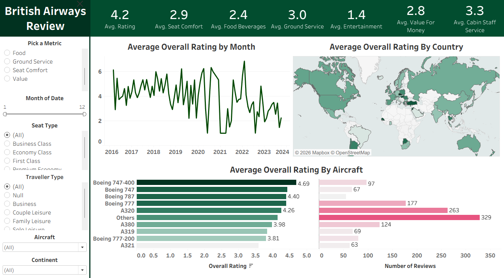

# ✈️ British Airways Review Analysis (Tableau)

## 📷 Dashboard Preview

## 📌 Project Overview

This project analyzes **British Airways** customer reviews to uncover insights about passenger satisfaction across multiple dimensions such as:

⭐ Overall Rating  
💺 Seat Comfort  
🍽️ Food & Beverages  
🎬 Entertainment  
🛎️ Ground Service  
💰 Value for Money  
👨‍✈️ Cabin Staff Review

The interactive **Tableau dashboard** provides a comprehensive view of **customer experience** trends over time, across countries, aircraft types, and traveler segments.

## 🎯 Business Objective

The goal of this analysis is to:

▫️Identify trends in overall customer satisfaction  
▫️Compare aircraft performance based on ratings  
▫️Analyze country-wise review distribution  
▫️Understand which service aspects impact overall rating  
▫️Help improve operational and service-level decision-making  

## 🛠️ Tools & Technologies Used

📊 Tableau – Data visualization & dashboard creation  
🧹 Data Cleaning & Preparation (CSV-based dataset)  
📁 GitHub – Project hosting and documentation  
📂 Dataset Information  

## The project uses structured review data including:

🔹Review Date  
🔹Country  
🔹Aircraft Type  
🔹Traveller Type  
🔹Seat Type (Economy, Business, First, etc.)  
🔹Overall Rating  
🔹Individual Service Ratings  
🔹Number of Reviews  

## 📊 Dashboard Features

### 1️⃣ KPI Summary Panel
**Displays:**  
🔸Average Overall Rating (4.2)  
🔸Seat Comfort (2.9)  
🔸Food & Beverages (2.4)  
🔸Ground Service (3.0)  
🔸Entertainment (1.4)  
🔸Value for Money (2.8)  
🔸Cabin Staff Service (3.3)  

### 2️⃣ 📈 Average Overall Rating by Month
🔹Time-series trend from 2016–2024  
🔹Helps identify fluctuations in customer satisfaction  
🔹Detects performance drops and improvement periods  

### 3️⃣ 🌍 Average Overall Rating by Country
🔹Geographic distribution of ratings  
🔹Highlights strong and weak performance regions  
🔹Useful for regional service strategy  

### 4️⃣ ✈️ Average Overall Rating by Aircraft
🔹Aircraft performance comparison  
🔹Includes review count for reliability context  
🔹Example:  
    🔸Boeing 747-400 – 4.69 ⭐  
    🔸Boeing 787 – 4.40 ⭐  
    🔸A320 – 4.26 ⭐  
    🔸Boeing 777-200 – 3.81 ⭐  

### 5️⃣ 🔎 Interactive Filters
🔹Users can dynamically filter by:  
🔹Metric (Overall Rating, Cabin Staff, Entertainment, etc.)  
🔹Month  
🔹Seat Type  
🔹Traveller Type  
🔹Aircraft  
🔹Continent  

This makes the dashboard fully exploratory and business-ready.

## 📌 Key Insights

▫️Overall rating fluctuates significantly post-2020.  
▫️Entertainment and Food ratings are comparatively lower than other service aspects.  
▫️Some aircraft types consistently outperform others.  
▫️Cabin staff service maintains relatively stable ratings.  
▫️Value for money remains moderate compared to expectations.  

## 🚀 How to Use

1️⃣ Download the Tableau file (.twbx / .twb)  
2️⃣ Open in Tableau Desktop or Tableau Public  
3️⃣ Interact with filters to explore insights  
